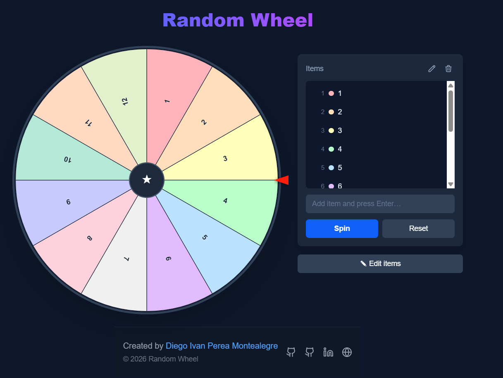

# Random Wheel Spinner

A modern, interactive random wheel spinner built with Next.js, TypeScript, and Tailwind CSS. Create custom wheels with your own items and spin to get random results with smooth animations and a beautiful UI.


<p align="center">
  
</p>


## ✨ Features

- **🎯 Custom Wheel Creation**: Add unlimited custom items to your wheel
- **🎨 Beautiful Design**: Modern UI with pastel colors and smooth animations
- **📱 Fully Responsive**: Works perfectly on desktop, tablet, and mobile devices
- **✏️ Edit Items**: Edit wheel items inline without losing your configuration
- **🎲 Fair Random Selection**: Uses cryptographically secure random number generation
- **🎬 Smooth Animations**: Realistic wheel spinning with easing functions
- **🏆 Winner Display**: Elegant modal showing the selected winner
- **🔄 Reset Function**: Quick reset to clear the current spin result
- **🗑️ Clear All**: Remove all items and start fresh

## 🛠️ Technologies Used

- **[Next.js](https://nextjs.org/)** - React framework with App Router
- **[TypeScript](https://www.typescriptlang.org/)** - Type-safe JavaScript
- **[Tailwind CSS](https://tailwindcss.com/)** - Utility-first CSS framework
- **React Hooks** - State management and lifecycle methods

## 🚀 Getting Started

### Prerequisites

- Node.js 18+
- npm, yarn, or pnpm

### Installation

1. Clone the repository:

```bash
git clone 
```

2. Install dependencies:

```bash
npm install
# or
yarn install
# or
pnpm install
```

3. Run the development server:

```bash
npm run dev
# or
yarn dev
# or
pnpm dev
```

4. Open [http://localhost:3000](http://localhost:3000) in your browser.


## 🤝 Contributing

Contributions are welcome! Please feel free to submit a Pull Request.

1. Fork the project
2. Create your feature branch (`git checkout -b feature/AmazingFeature`)
3. Commit your changes (`git commit -m 'Add some AmazingFeature'`)
4. Push to the branch (`git push origin feature/AmazingFeature`)
5. Open a Pull Request

## 📄 License

This project is licensed under the MIT License - see the [LICENSE](LICENSE) file for details.

---

## 👨‍💻 Author / Autor

**Diego Ivan Perea Montealegre**

- GitHub: [@diegoperea20](https://github.com/diegoperea20)

---

Created by [Diego Ivan Perea Montealegre](https://github.com/diegoperea20)
